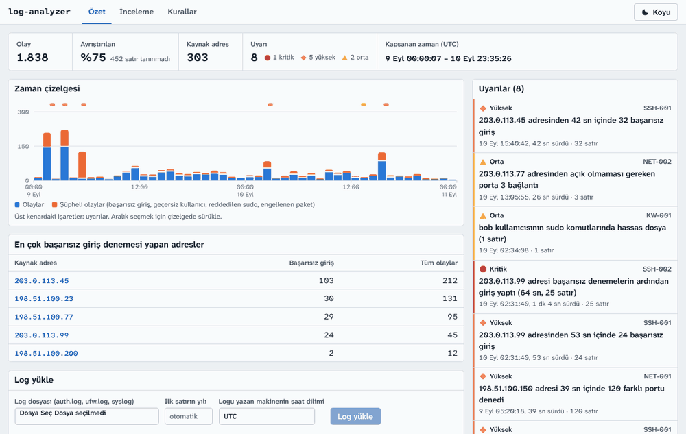
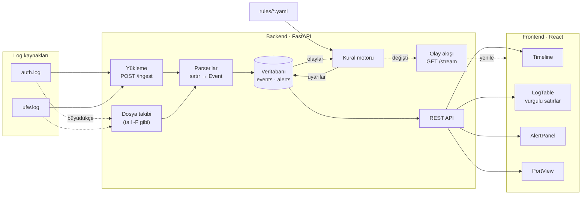
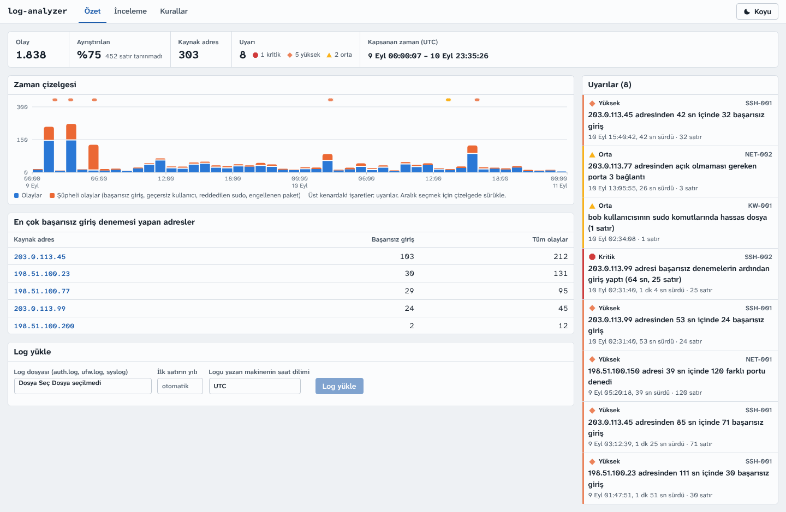
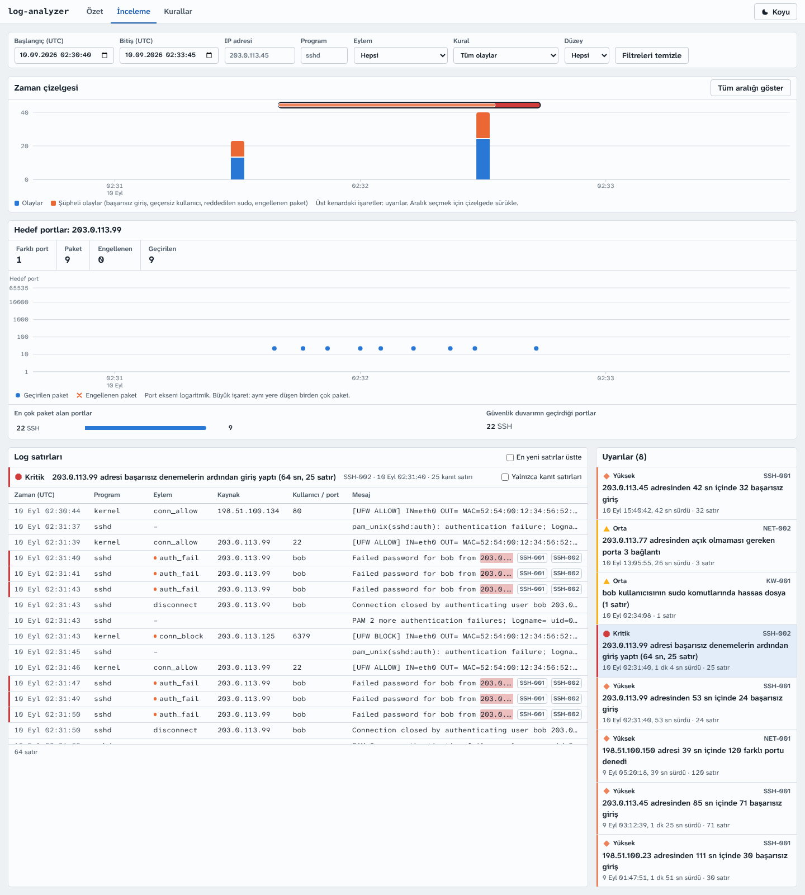
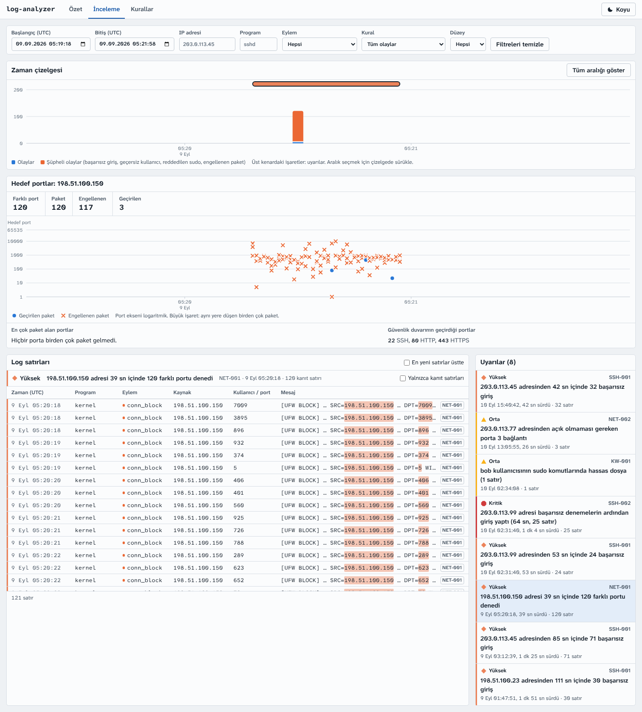
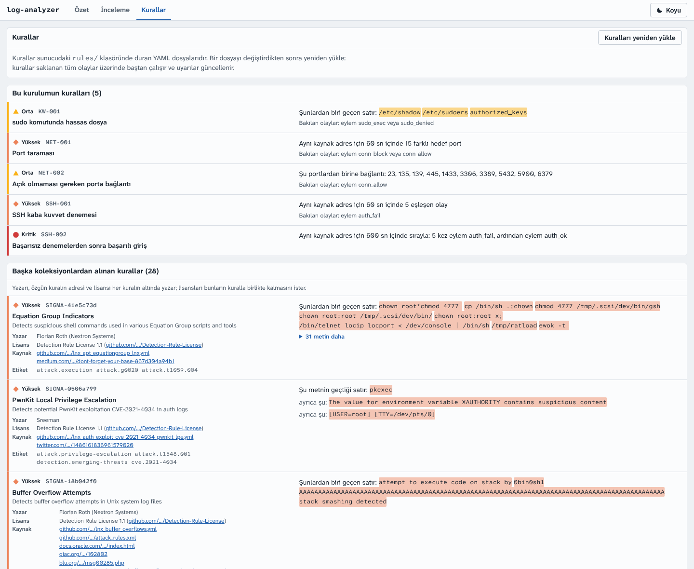
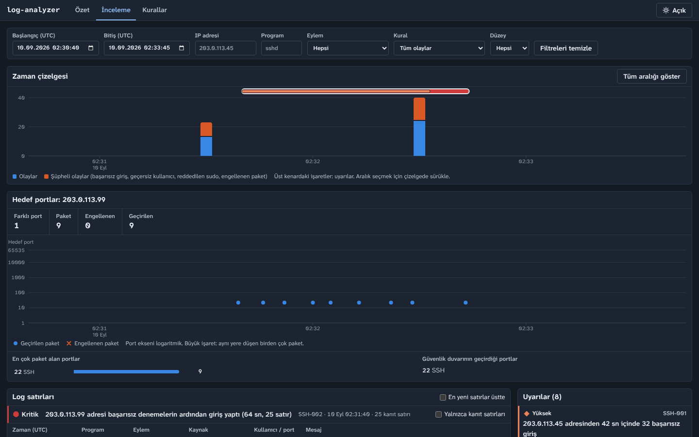
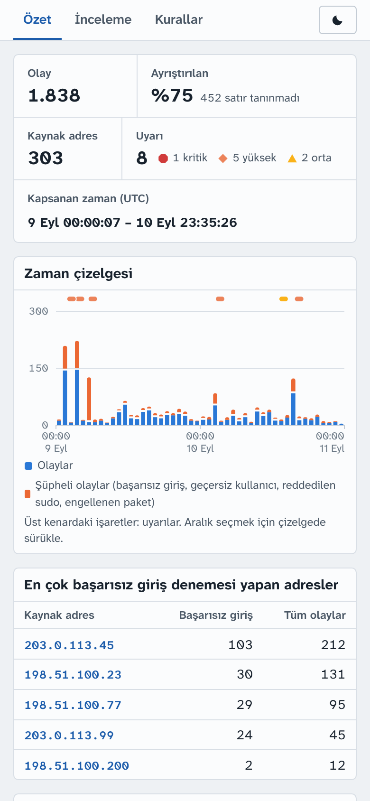

# log-analyzer

[](https://github.com/ibrahimBakkal/log-analyzer/actions/workflows/ci.yml)
[](https://github.com/ibrahimBakkal/log-analyzer/actions/workflows/ci.yml)

Sunucu loglarını (SSH `auth.log` ve güvenlik duvarı `ufw.log`) yapılandırılmış olaylara çevirip zaman çizelgesinde gösteren ve kural tabanlı uyarılar üreten bir log analiz aracı. Arka uç Python/FastAPI, arayüz React.



## Amaç

Bir sunucunun loglarına bakıp "burada ne oldu, ne zaman, kim yaptı?" sorusunu hızlı yanıtlamak:

- **Ayrıştırma:** ham satırlar zaman, kaynak IP, port, kullanıcı ve eylem (`auth_fail`, `auth_ok`, `conn_block`, …) alanlarına ayrılır. Tanınmayan satırlar atılmaz, `unparsed` olarak saklanır.
- **Zaman çizelgesi:** olay yoğunluğu zaman ekseninde gösterilir; sıçramalar bir bakışta görülür.
- **Kurallar:** YAML ile yazılan anahtar kelime, eşik, sıralı olay ve port kuralları şüpheli davranışı işaretler. Depoda beş kendi kuralı ve [SigmaHQ](https://github.com/SigmaHQ/sigma)'dan alınmış 28 kural var.
- **Kanıt:** her uyarı, onu tetikleyen log satırlarıyla birlikte gösterilir; satırlarda eşleşen kısımlar vurgulanır.
- **Canlı takip:** sunucu bir log dosyasını büyüdükçe okuyabilir; yeni satırlar bir iki saniye içinde uyarıya dönüşür ve açık sayfalar kendiliğinden yenilenir.

| Belge | İçeriği |
|---|---|
| [Vaka çalışması](docs/vaka-calismasi.md) | Örnek loglardaki en ciddi olayın araçla adım adım incelenmesi |
| [Kural nasıl yazılır](docs/kural-yazma.md) | Kural türleri, alanlar, zamanın sayılması, kuralı deneme, Sigma ile karşılaştırma |
| [Tespit ölçümü](docs/tespit-olcumu.md) | Kuralların neyi yakaladığı, neyi kaçırdığı, neye yanlış alarm verdiği |
| [Performans](docs/performans.md) | Bir milyon satırla ölçümler, yapılan iyileştirmeler, hâlâ yavaş olanlar |
| [Sigma'dan alınan kurallar](rules/sigma/README.md) | Hangi kuralların alındığı, nasıl çevrildiği, lisansı |

## Hızlı başlangıç

[Docker](https://docs.docker.com/get-docker/) kuruluysa başka hiçbir şey gerekmez:

```bash
git clone https://github.com/ibrahimBakkal/log-analyzer.git
cd log-analyzer
docker compose up --build
```

Birkaç dakikalık ilk derlemeden sonra arayüz `http://localhost:8080` adresinde açılır. İki örnek log yüklü gelir: 1.838 satır, sekiz uyarı. Ne anlattıkları [Örnek veri](#örnek-veri) bölümünde yazar.

| Ne | Nasıl |
|---|---|
| Başka bir port | `LOG_ANALYZER_PORT=9000 docker compose up` |
| Kendi logunu yüklemek | Özet sayfasındaki form, ya da `curl -F "file=@/var/log/auth.log" http://localhost:8080/api/ingest` |
| Kural değiştirmek | `rules/` klasöründeki dosyayı düzenle, Kurallar sayfasında "Kuralları yeniden yükle" |
| Bir logu canlı izlemek | `docker-compose.yml` içindeki `LOG_ANALYZER_FOLLOW` ve `/var/log` satırlarını aç |
| Boş başlamak | `docker-compose.yml` içindeki iki `LOG_ANALYZER_LOAD` satırını sil |
| Her şeyi silip baştan başlamak | `docker compose down --volumes` |
| API dokümanı | `http://localhost:8080/api/docs` |
| Kurulumu denemek | `python scripts/smoke.py` |

İki konteyner çalışır: `api` (FastAPI; veritabanı `data` adlı birimde durur, yeniden başlatınca kaybolmaz) ve `web` (arayüzü sunan ve `/api/` altındaki istekleri API'ye geçiren nginx). Docker'sız kurulum [Kurulum](#kurulum) bölümünde.

## Mimari



1. Log dosyası `POST /ingest` ile yüklenir ya da sunucu dosyayı büyüdükçe kendisi okur; parser her satırı bir `Event` kaydına çevirir.
2. Olaylar SQLAlchemy üzerinden veritabanına (SQLite) yazılır. Bir dosya ilk satırından tanınır; aynı dosya tekrar ya da rotasyon sonrası başka bir adla gelirse kopya oluşmaz.
3. Kural motoru `rules/` altındaki YAML kurallarıyla olayları tarar; eşleşmeleri kanıt satırlarıyla birlikte `Alert` olarak kaydeder.
4. React arayüzü REST API (`/events`, `/timeline`, `/alerts`, `/stats`, `/ports`) üzerinden zaman çizelgesini, log tablosunu, uyarıları ve port görünümünü gösterir.
5. Veri değişince sunucu bunu `GET /stream` üzerinden duyurur; açık sayfalar gösterdiklerini yeniden ister.

## Depo yapısı

```text
log-analyzer/
├── .github/workflows/
│   └── ci.yml            # her push'ta lint, testler ve Docker kurulumunun denenmesi
├── backend/
│   ├── app/
│   │   ├── parsers/      # syslog başlığı, auth.log kalıpları, UFW paket logu, parser kayıt defteri
│   │   ├── rules/        # kural şeması, YAML yükleyici, değerlendiriciler, uyarı motoru, anahtar kelime taraması
│   │   ├── routers/      # /health, /ingest, /events, /alerts, /rules, /timeline, /stats, /ports, /stream, /follow
│   │   ├── ingest.py     # satır satır okuma, sıkıştırılmış dosyalar, toplu yazım
│   │   ├── follow.py     # büyüyen dosyaları izleme, rotasyon
│   │   ├── live.py       # değişiklikleri dinleyenlere duyurma
│   │   ├── load.py       # sunucu olmadan log yükleme: python -m app.load
│   │   ├── sigma.py      # Sigma kurallarını çevirme: python -m app.sigma
│   │   ├── models.py     # Event, Alert ve AlertEvent tabloları
│   │   └── main.py       # FastAPI uygulaması
│   ├── migrations/       # Alembic migration'ları
│   ├── tests/
│   ├── Dockerfile        # API imajı
│   ├── alembic.ini
│   └── pyproject.toml    # bağımlılıklar ve pytest ayarı
├── docs/                 # vaka çalışması, kural yazma, tespit ölçümü, performans, ekran görüntüleri
├── frontend/             # React arayüzü (Vite, TypeScript, Tailwind)
│   ├── e2e/              # arayüzü gerçek tarayıcıda baştan sona deneyen betik (Playwright)
│   ├── Dockerfile        # arayüz imajı (nginx; /api isteklerini API'ye geçirir)
│   └── src/
│       ├── pages/        # Özet, İnceleme, Kurallar
│       ├── components/   # Timeline, LogTable, AlertPanel, PortView, FilterBar, ...
│       ├── lib/          # vurgu bölme, filtre ↔ adres, zaman ve port yardımcıları (testleriyle)
│       ├── demo/         # sunucusuz demo: örnek logların kaydı ve tarayıcıda çalışan API karşılığı
│       ├── api.ts        # API tipleri ve çağrıları
│       └── queries.ts    # TanStack Query kancaları
├── docker-compose.yml    # api + web, örnek loglar yüklü
├── scripts/
│   └── smoke.py          # çalışan bir kurulumun örnek verilerle doğru yanıt verdiğini dener
├── rules/                # tespit kuralları (YAML): KW-001, SSH-001, SSH-002, NET-001, NET-002
│   └── sigma/            # SigmaHQ deposundan alınan 28 kural, lisansı ve nasıl çevrildiği
├── samples/
│   ├── generate.py       # örnek auth.log üreteci
│   ├── generate_ufw.py   # aynı iki günün güvenlik duvarı logunu üretir
│   ├── build_demo.py     # demo için API yanıtlarını kaydeder
│   ├── benchmark.py      # büyük bir logla yükleme, kural ve API sürelerini ölçer
│   ├── measure.py        # kuralların yakaladığını, kaçırdığını ve yanlış alarmlarını sayar
│   ├── auth.log          # üretilmiş, anonim örnek loglar
│   └── ufw.log
└── ruff.toml             # lint ve biçim ayarı
```

## Kurulum

Python 3.11 veya üstü gerekir. Komutlar depo kökünde çalıştırılır.

```bash
python3.11 -m venv .venv
source .venv/bin/activate          # Windows: .venv\Scripts\activate
pip install -e "backend[dev]"
```

Windows'ta sanal ortamı `py -3.11 -m venv .venv` ile oluşturabilirsin.

Arayüz için Node.js 22 veya üstü gerekir:

```bash
cd frontend
npm install
```

Kontroller:

```bash
ruff check .             # lint
ruff format --check .    # biçim
pytest backend           # testler
pytest backend --cov=app # testler ve hangi satırların denenmediği

cd frontend
npm run typecheck        # TypeScript tip denetimi
npm test                 # Vitest
npm run build            # üretim derlemesi
npm run build:demo       # sunucusuz demo derlemesi
npm run e2e              # arayüzü gerçek bir tarayıcıda dener; çalışan bir kurulum ister (aşağıya bak)
```

`npm run e2e`, örnek logların yüklü olduğu çalışan bir kurulumda (varsayılan: `docker compose up` ile açılan `http://localhost:8080`) arayüzü baştan sona dolaşır: uyarıya tıklayınca zaman çizelgesinin o aralığa gitmesi, kanıt satırlarının vurgulanması, filtreler, sayfalama, port görünümü, kurallar sayfası, tema, telefon genişliği. İlk kullanımda tarayıcıyı kurmak gerekir: `npx playwright install chromium`. Geliştirme sunucularına karşı çalıştırmak için `WEB=http://localhost:5173 API=http://127.0.0.1:8000 npm run e2e`.

Aynı kontroller her push ve pull request'te GitHub Actions ile de çalışır (`.github/workflows/ci.yml`); orada ayrıca Docker kurulumu derlenir, başlatılır, `scripts/smoke.py` ile ve tarayıcıda (`npm run e2e`) denenir; sunucusuz demo da aynı tarayıcı testinden geçer.

## Çalıştırma

```bash
cd backend
alembic upgrade head             # veritabanını oluşturur: backend/log_analyzer.db
uvicorn app.main:app --reload    # http://127.0.0.1:8000
```

Başka bir terminalde, depo kökünden örnek logları yükleyip sorgula:

```bash
curl -F "file=@samples/auth.log" -F "year=2026" http://127.0.0.1:8000/ingest
# {"source_file":"auth.log","lines":1057,"parsed":605,"unparsed":452,"duplicates":0,"conflicts":0,"alerts":6}
curl -F "file=@samples/ufw.log" -F "year=2026" http://127.0.0.1:8000/ingest
# {"source_file":"ufw.log","lines":781,"parsed":781,"unparsed":0,"duplicates":0,"conflicts":0,"alerts":8}

curl "http://127.0.0.1:8000/alerts"
curl "http://127.0.0.1:8000/events?action=auth_ok&limit=5"
curl "http://127.0.0.1:8000/events?ip=203.0.113.99&start=2026-09-10T02:30:00Z"
curl "http://127.0.0.1:8000/ports?ip=198.51.100.150"
```

Aynı yükleme sunucu çalışmıyorken komut satırından da yapılabilir:

```bash
cd backend
python -m app.load ../samples/auth.log ../samples/ufw.log --year 2026
```

Arayüzü ayrı bir terminalde başlat:

```bash
cd frontend
npm run dev                      # http://localhost:5173
```

Arayüz API'yi `http://127.0.0.1:8000` adresinde arar; başka bir adres için `VITE_API_URL` ortam değişkenini ayarla. API tarafında arayüzün adresi `LOG_ANALYZER_CORS_ORIGINS` ile izinli olmalıdır (varsayılan: Vite geliştirme sunucusu).

Etkileşimli API dokümanı `http://127.0.0.1:8000/docs` adresindedir. Veritabanı adresi `LOG_ANALYZER_DATABASE_URL`, kural klasörü `LOG_ANALYZER_RULES_DIR` ortam değişkeniyle değiştirilebilir.

### Canlı takip

Sunucu, verilen log dosyalarını `tail -F` gibi izleyebilir: dosyaya eklenen satırlar bir iki saniye içinde olay olur, kurallar yeniden çalışır ve açık sayfalar kendiliğinden yenilenir.

```bash
cd backend
LOG_ANALYZER_FOLLOW=/var/log/auth.log,/var/log/ufw.log uvicorn app.main:app
# Windows PowerShell:  $env:LOG_ANALYZER_FOLLOW = "C:\loglar\auth.log"; uvicorn app.main:app
```

Denemek için boş bir dosyayı izlet ve örnek logdan satır ekle:

```bash
LOG_ANALYZER_FOLLOW=/tmp/deneme.log uvicorn app.main:app      # bir terminalde
head -n 300 ../samples/auth.log >> /tmp/deneme.log             # başka bir terminalde
```

| Ortam değişkeni | Anlamı | Varsayılan |
|---|---|---|
| `LOG_ANALYZER_FOLLOW` | İzlenecek dosyalar, virgülle ayrılmış. Henüz var olmayan bir dosya beklenir | yok |
| `LOG_ANALYZER_FOLLOW_TZ` | Dosyalardaki zaman damgalarının saat dilimi, ör. `Europe/Istanbul` | `UTC` |
| `LOG_ANALYZER_FOLLOW_INTERVAL` | İki bakış arasındaki süre, saniye | `1` |

- **Rotasyon:** Dosya yeniden adlandırılıp yerine yenisi açılırsa (`logrotate`), eski dosya sonuna kadar okunur, sonra yenisine geçilir. Dosya boşaltılıp baştan yazılırsa (`copytruncate`) o da fark edilir. Yeni dosyanın satırları, ilk satırının tarihini taşıyan ayrı bir adla saklanır: `auth.log (2026-09-14)`.
- **Yeniden başlatma:** Sunucu yeniden başlayınca kaldığı satırdan devam eder; sunucu kapalıyken yazılan satırlar kaybolmaz, hiçbir satır iki kez saklanmaz.
- **Yıl:** İzlenen dosyalarda yıl, satırı geleceğe düşürmeyen en yakın yıl olarak alınır.
- **Windows:** İzlenen dosya açık tutulur; Windows'ta bu, başka bir programın dosyayı yeniden adlandırmasını engelleyebilir. Satır eklemek sorun çıkarmaz.

## Arayüz

Arayüzün fikri, üzeri işaretlenmiş bir log çıktısıdır: her şey log satırlarına geri döner, kanıt olan satırlar fosforlu kalemle çizilmiş gibi vurgulanır.

| Özet | İnceleme: bir uyarının zamanı |
|---|---|
| [](docs/img/ozet.png) | [](docs/img/inceleme.png) |
| **Port taraması** | **Kurallar** |
| [](docs/img/port-taramasi.png) | [](docs/img/kurallar.png) |
| **Koyu tema** | **Telefonda** |
| [](docs/img/inceleme-koyu.png) | <a href="docs/img/telefon.png"></a> |

- **Özet:** Yüklenen logun sayıları, tüm dönemin zaman çizelgesi, uyarılar, en çok başarısız giriş denemesi yapan adresler ve log yükleme formu.
- **İnceleme:** Filtreler (zaman, adres, program, eylem, kural, düzey), zaman çizelgesi, log satırları ve uyarılar tek sayfada. Bir uyarıya tıklayınca çizelge o uyarının aralığına gider; tablo o aralıktaki tüm satırları gösterir, kanıt satırları kenar çizgisi ve vurgulu metinle ayrılır. Çizelgede sürükleyerek zaman aralığı seçilir. Filtreler sayfa adresinde tutulur, yani bir görünüm yer imine eklenebilir ve geri tuşu çalışır.
- **Canlı gösterge:** Sunucu dosya izliyorsa üst çubukta "Canlı" yazar; yeni satırlar geldiğinde yanında kaç tane geldiği belirir. Tıklayınca izlenen dosyalar ve durumları listelenir. Bağlantı koparsa gösterge bunu söyler, geri gelince sayfa kendini yeniler. İnceleme sayfasındaki "En yeni satırlar üstte" seçeneğiyle yeni gelen satırlar tablonun başında görünür.
- **Port görünümü:** İnceleme sayfasında bir adres öne çıktığında (IP filtresi ya da o adresle ilgili bir uyarı) ve güvenlik duvarı o adresi kaydetmişse, zaman çizelgesinin altında aynı zaman ekseniyle bir port grafiği belirir: her paket bir işaret, düşey eksen hedef port. Tarama, kısa sürede dikey dağılan bir işaret yığını olarak görünür; tek porta ısrar, yatay bir sıra olarak. Altında en çok paket alan portlar ve güvenlik duvarının geçirdiği portlar listelenir.
- **Kurallar:** Yüklü kurallar ve ne aradıkları: anahtar kelimeler, kuralın satırda işaretleyeceği gibi işaretlenmiş olarak; başka koleksiyonlardan alınan kurallar yazarı, kaynağı ve lisansıyla ayrı listelenir. Yüklenemeyen kural dosyaları nedeniyle birlikte görünür. Kuralları yeniden yükleme düğmesi buradadır.

### Demo: sunucusuz arayüz

Arayüzün, iki örnek logu içinde taşıyan ve hiçbir sunucuya bağlanmayan bir derlemesi vardır. Tek bir HTML dosyasıdır: diskten açılabilir, herhangi bir statik barındırıcıya konabilir.

```bash
cd frontend
npm run build:demo               # frontend/dist-demo/index.html (yaklaşık 1,6 MB)
```

Demoda zaman çizelgesi, filtreler, uyarılar, kanıt satırları, port görünümü ve kurallar sayfası gerçek arayüzdekiyle aynıdır; log yükleme, kuralları yeniden yükleme ve canlı takip yoktur. Veriler `frontend/src/demo/snapshot.json` dosyasından gelir: gerçek API'nin örnek loglar için verdiği yanıtların kaydı. Sorgular tarayıcıda yanıtlanır (`frontend/src/demo/backend.ts`), ve bu yanıtların API'ninkilerle aynı olduğu testlerle denetlenir: `cases.json` gerçek API'ye sorulmuş soruları ve yanıtlarını tutar, Vitest aynı soruları demoya sorar.

Parser ya da kurallar değişince kayıt yeniden üretilir; güncel değilse backend testleri bunu söyler:

```bash
python samples/build_demo.py     # snapshot.json ve cases.json dosyalarını yeniden yazar
```

Log tablosu yalnızca görünen satırları çizer (react-window) ve kaydırdıkça sonraki sayfaları getirir. Uzun satırlarda vurguların çevresindeki metin kısaltılır (`[UFW BLOCK] … SRC=198.51.100.150 … DPT=23`); satıra tıklayınca dosyadaki hali vurgularıyla birlikte görünür. Önem dereceleri renkle birlikte şekil ve yazıyla da gösterilir. Açık ve koyu tema vardır; zamanlar UTC olarak gösterilir.

## API

| Uç nokta | Ne yapar |
|---|---|
| `GET /health` | Veritabanı hazırsa `{"status": "ok"}` döner |
| `POST /ingest` | Log dosyası yükler (multipart form) ve kuralları yeniden çalıştırır. Dosya gzip, bzip2 ya da xz ile sıkıştırılmış olabilir. Alanlar: `file`, `parser` (`auto`, `auth`, `ufw`; varsayılan `auto`), `year`, `tz`, `source` |
| `GET /events` | Olayları zaman sırasıyla listeler; `order=desc` ile en yeniden eskiye. Filtreler: `start`, `end`, `host`, `service`, `ip`, `level`, `action`, `parsed`, `alert_id`, `rule_id`. Sayfalama: `limit` (1–500), `cursor` |
| `GET /alerts` | Uyarıları yeniden eskiye listeler. Filtreler: `rule_id`, `severity`, `group_key`, `start`, `end`. `include_events=true` her uyarının ilk 100 kanıt satırını ekler. Kuralı bir yazar adı taşıyorsa uyarı da taşır (`rule_author`) |
| `GET /timeline` | Seçilen olayları zaman kovalarına göre sayar (`bucket`: `1m`, `5m`, `1h`, `1d`). `/events` ile aynı filtreleri alır |
| `GET /stats` | Özet sayıları döner: olay, ayrıştırılan, eylem dağılımı, önem derecesine göre uyarı, en çok başarısız giriş yapan adresler |
| `GET /ports` | Bir kaynak adresin (`ip`) denediği hedef portlar: port başına engellenen ve geçirilen paket sayısı, zaman sırasıyla tek tek paketler. `start` ve `end` ile aralık seçilir |
| `GET /rules` | Yüklü kuralları ve yüklenemeyen kural dosyalarını (nedeniyle) döner |
| `POST /rules/reload` | Kural dosyalarını yeniden okur ve kuralları saklanan tüm olaylar üzerinde baştan çalıştırır |
| `GET /stream` | Sunucudan gönderilen olaylar (SSE): veri her değiştiğinde bir `update`, izlenen dosyaların durumu değiştiğinde bir `status` olayı. Veri taşımaz; "yeniden sor" demektir |
| `GET /follow` | İzlenen dosyalar: durum, kaç satır okunduğu, satırların hangi adla saklandığı |

- **Zaman:** Syslog satırlarında yıl ve saat dilimi yoktur. `year` dosyanın ilk satırının yılıdır; verilmezse o satırı geleceğe düşürmeyen en yakın yıl kullanılır ve Aralık'tan Ocak'a geçişte yıl kendiliğinden ilerler. `tz` logu yazan makinenin saat dilimidir (ör. `Europe/Istanbul`, varsayılan `UTC`). Tüm zamanlar UTC olarak saklanır ve döner.
- **Parser:** `auto` bilinen bütün biçimlerin satırlarını tanır, yani aynı dosyada `sshd` ve çekirdek satırları bir arada olabilir (`/var/log/syslog` gibi). `auth` yalnızca `sshd` ve `sudo` satırlarını, `ufw` yalnızca çekirdeğin paket loglarını (`[UFW BLOCK]`, `[UFW ALLOW]`, `iptables` önekleri) tanır.
- **Her satır saklanır:** Tanınan satırlar alanlarıyla birlikte (`action`: `auth_fail`, `auth_ok`, `invalid_user`, `disconnect`, `sudo_exec`, `sudo_denied`, `conn_block`, `conn_allow`), tanınmayanlar `parsed=false` olarak. Yükleme yanıtında `lines = parsed + unparsed + duplicates + conflicts`.
- **Tekrar yükleme ve rotasyon:** Bir dosya adından değil ilk satırından, satırları da satır numarasından tanınır. Aynı dosya tekrar yüklenirse kopya oluşmaz (`duplicates`); büyümüş bir dosyada yalnızca yeni satırlar eklenir; rotasyonla adı `auth.log.1` ya da `auth.log.2.gz` olmuş bir dosya, eskiden olduğu dosya olarak tanınır. Daha önce kullanılmış bir adla gelen yeni bir dosya, ilk satırının tarihi eklenmiş adla saklanır (`auth.log (2026-09-14)`); yanıttaki `source_file` satırların hangi adla saklandığını söyler. `conflicts`, aynı dosyada aynı satır numarasının farklı bir metinle kayıtlı olduğu satırları sayar (dosya sonradan düzenlenmiş); saklanan satıra dokunulmaz.
- **Sayfalama:** Yanıttaki `next_cursor` değeri sonraki isteğe `cursor` olarak verilir; son sayfada `null` olur.
- **Vurgular:** Bir uyarının kanıtı olan olaylar `highlights` alanında hangi uyarıya ve kurala ait olduklarını, `start`/`end` ile de `message` içinde işaretlenecek kısmı taşır. Bir uyarının bütün kanıtları `GET /events?alert_id=…` ile sayfalanır.
- **Zaman filtreleri:** `start` dahil, `end` hariçtir. Ofsetsiz zamanlar UTC sayılır. URL'de `+03:00` yazarken `+` işaretini `%2B` olarak kodla.

## Kurallar

Kurallar `rules/` klasöründeki ve içindeki klasörlerdeki YAML dosyalarıdır; her dosyada bir kural bulunur. Uygulama açılırken hepsini yükler. `POST /rules/reload` dosyaları yeniden okur ve kuralları saklanan tüm olaylar üzerinde baştan çalıştırır. Hatalı bir dosya diğerlerinin yüklenmesini engellemez; neyin yanlış olduğu `GET /rules` yanıtındaki `errors` listesinde yazar.

```yaml
# rules/SSH-001.yaml
id: SSH-001
name: SSH kaba kuvvet denemesi
type: threshold
severity: high
match:
  action: auth_fail
group_by: src_ip
threshold: 5
window_seconds: 60
cooldown_seconds: 300
summary: "{key} adresinden {seconds} sn içinde {count} başarısız giriş"
```

| `type` | Ne zaman uyarır | Depodaki örneği |
|---|---|---|
| `keyword` | Aranan metin geçen her satırda | `KW-001`: sudo komutunda `/etc/shadow`, `/etc/sudoers`, `authorized_keys` |
| `threshold` | Bir gruptan kısa sürede çok sayıda eşleşen olay gelince | `SSH-001`: bir dakikada beş başarısız giriş |
| `sequence` | Bir grup, adımları sırayla ve süre dolmadan tamamlayınca | `SSH-002`: beş başarısız denemenin ardından başarılı giriş |
| `port_scan` | Bir grup kısa sürede çok sayıda farklı hedef porta paket gönderince | `NET-001`: bir dakikada 15 farklı port |
| `rare_port` | Beklenmeyen bir porta bağlantı görülünce | `NET-002`: güvenlik duvarından geçen telnet, SMB, RDP, VNC, veritabanı bağlantıları |

Kendi kuralını yazmak için gereken her şey (alanlar, türlerin ayarları, zamanın nasıl sayıldığı, kuralı deneme yolları, Sigma ile karşılaştırma) ayrı bir belgede: **[Kural nasıl yazılır](docs/kural-yazma.md)**.

Uyarılar olaylardan ve kurallardan türetilir: her yüklemeden ve her `reload` çağrısından sonra güncellenir. Aynı olay kümesinin uyarısı kimliğini korur; yeni olaylar geldikçe büyür.

Örnek `auth.log` yüklendiğinde altı uyarı oluşur. `SSH-001` üç saldırganı yakalar (`203.0.113.45` için iki dalga, iki ayrı uyarı), `SSH-002` parolayı bulup içeri giren saldırganı, `KW-001` onun `sudo cat /etc/shadow` denemesini. 29 kez deneyen yavaş saldırgan, tek tük denemeler ve parolasını bir kez yanlış yazan `bob` uyarı üretmez. `ufw.log` da yüklenince iki uyarı eklenir: `NET-001` port taramasını, `NET-002` açık kalmış uzak masaüstü portuna gelen bağlantıları yakalar; olağan trafik ve yavaş tarama uyarı üretmez.

Kuralların sınırı, yani neyi kaçırdıkları ve neye yanlış alarm verdikleri ayrıca ölçüldü: **[Tespit ölçümü](docs/tespit-olcumu.md)**.

### Sigma'dan alınan kurallar

`rules/sigma/` klasöründe [SigmaHQ](https://github.com/SigmaHQ/sigma) deposundan alınmış 28 kural vardır: sshd'nin istismar denemelerine işaret eden hataları, bilinen yetki yükseltme açıkları (CVE-2019-14287, PwnKit, Nimbuspwn), ters kabuk ve indir-çalıştır komutları, komut geçmişini ve logları silme, güvenlik araçlarını durdurma gibi kalıpları ararlar. Sigma kurallarının çoğu bu aracın toplamadığı kayıtları (süreç başlatma, auditd, Windows olayları) ister; alınanlar, log satırlarında metin arayanlardır.

Kuralları `python -m app.sigma` komutu çevirdi. Hangi kuralların alındığı, hangilerinin neden alınmadığı, lisans (Detection Rule License 1.1) ve Sigma alanlarının buradaki karşılıkları [`rules/sigma/README.md`](rules/sigma/README.md) dosyasında yazar. Her kural yazarını, özgün kuralın adresini ve lisansını taşır; arayüz bunları kuralın ve uyarılarının yanında gösterir.

Örnek loglarda bu kurallar uyarı üretmez: örnek senaryolar giriş denemeleri ve port taramasıdır, bu kuralların aradığı komutları ve hata mesajlarını içermez.

## Örnek veri

İki örnek dosya aynı sunucunun aynı iki gününü anlatır ve birlikte yüklenebilir. İkisi de sentetiktir, gerçek bir makineden hiçbir şey içermez; tüm IP adresleri RFC 5737 dokümantasyon aralıklarından (`192.0.2.0/24`, `198.51.100.0/24`, `203.0.113.0/24`), kullanıcı adları sabit bir listeden gelir.

### auth.log

`samples/auth.log`, `samples/generate.py` tarafından üretilen bir SSH logudur: 9–10 Eylül arası 48 saat, 1.057 satır.

Zaman damgaları klasik syslog biçimindedir ve yıl içermez (`Sep  9 03:12:39`); log 2026 yılı için üretildi.

Olağan etkinliğin arasına (üç kullanıcının oturumları, `sudo` komutları, saatlik cron, 56 farklı adresten tek tük giriş denemesi) kuralları sınamak için dört senaryo yerleştirildi:

| Kaynak IP | Zaman | Ne oluyor | Kurallar açısından |
|---|---|---|---|
| `198.51.100.23` | 9 Eyl 01:47–01:49 | Var olmayan 30 farklı kullanıcı adıyla birer deneme | Eşik kuralı tetiklenmeli |
| `203.0.113.45` | 9 Eyl 03:12–03:14<br>10 Eyl 15:40–15:41 | `root` için 71 başarısız parola, ertesi gün 32 tane daha | Eşik kuralı tetiklenmeli; iki dalga cooldown ve uyarı birleştirmeyi sınar |
| `198.51.100.77` | 9 Eyl 10:00–21:48 | 20–30 dakikada bir, toplam 29 başarısız parola | Hız eşiğinin altında kalır: eşik kuralı tetiklenmemeli |
| `203.0.113.99` | 10 Eyl 02:31–02:37 | `bob` için bir dakikada 24 başarısız parola, ardından **başarılı giriş** ve reddedilen iki `sudo` denemesi | Eşik kuralı ve "başarısızlıklardan sonra başarı" sıralı kuralı tetiklenmeli |

Bilinen kullanıcıların (`alice`, `bob`, `deploy`) hepsi `192.0.2.0/24` içinden bağlanır. `bob`, 9 Eylül 10:34'te kendi adresinden parolasını bir kez yanlış yazıp ardından giriş yapar; bu, sıralı kuralın alarm vermemesi gereken durumdur.

Logu yeniden üretmek için:

```bash
python samples/generate.py                      # samples/auth.log dosyasını yeniden yazar
python samples/generate.py --seed 7 -o baska.log
python samples/generate.py --start 2026-12-31   # Aralık → Ocak geçişini içeren log
```

Aynı `--seed` ve `--start` her zaman aynı dosyayı üretir. Testler, depodaki `auth.log` dosyasının üretecin varsayılan çıktısıyla birebir aynı olduğunu, dokümantasyon aralıkları dışında IP içermediğini ve senaryoların temel özelliklerini (üç hızlı saldırı yoğun, geri kalan her şey seyrek, yabancı adresten tek başarılı giriş) doğrular.

### ufw.log

`samples/ufw.log`, `samples/generate_ufw.py` tarafından üretilen güvenlik duvarı logudur: 781 satır, hepsi çekirdeğin `[UFW BLOCK]` ve `[UFW ALLOW]` paket kayıtları. `auth.log` içindeki her SSH bağlantısı burada 22 numaralı porta geçirilen bir paket olarak görünür; ayrıca web trafiği (80, 443) ve internetin olağan gürültüsü (çeşitli portlara tek tük, engellenen paketler) vardır. Üç senaryo içerir:

| Kaynak IP | Zaman | Ne oluyor | Kurallar açısından |
|---|---|---|---|
| `198.51.100.150` | 9 Eyl 05:20 | 39 saniyede 120 farklı porta birer paket; açık üç port (22, 80, 443) dışında hepsi engellenir | `NET-001` tetiklenmeli |
| `203.0.113.150` | 9 Eyl 12:00–17:34 | Yarım saatte bir, toplam 12 farklı port | Pencereye sığmaz: `NET-001` tetiklenmemeli |
| `203.0.113.77` | 10 Eyl 13:05 | Unutulmuş bir kural yüzünden açık kalan 3389 (RDP) portuna geçirilen üç bağlantı | `NET-002` tetiklenmeli |

Tarama logu gerçek bir araçla değil üreteçle yazıldı; kendi laboratuvarında (yalnızca sahibi olduğun makinelerde) alınmış gerçek bir tarama logu aynı yoldan yüklenip denenebilir.

```bash
python samples/generate_ufw.py                  # samples/ufw.log dosyasını yeniden yazar
```

Gerçek loglar yanlışlıkla depoya girmesin diye `.gitignore` tüm `*.log` dosyalarını dışarıda tutar; yalnızca bu iki örnek dosya izlenir.

## Bilinen sınırlamalar

**Güvenlik**

- **Kimlik doğrulama yok.** API ve arayüz, erişebilen herkese her şeyi gösterir ve log yüklemesine izin verir. Araç tek kişinin kendi makinesinde ya da kapalı bir ağda kullanması için yazıldı; internete açılmamalıdır.
- Loglar olduğu gibi saklanır: kullanıcı adları, adresler ve sudo komutları veritabanındadır. Veritabanı dosyası logların kendisi kadar korunmalıdır.

**Loglar**

- Yalnızca syslog başlıklı satırlar okunur (klasik `Sep  9 03:12:39` ve ISO 8601 zaman damgalı). İçeriği tanınan programlar `sshd`, `sudo` ve çekirdeğin UFW/iptables paket kayıtlarıdır; öbür programların satırları saklanır ve anahtar kelime kurallarıyla aranabilir, ama alanlarına ayrılmaz.
- Web sunucusu erişim logları, journald dışa aktarımı, auditd ve Windows olay kayıtları okunmaz. Bu yüzden bir oturumda sudo dışında çalıştırılan komutlar görünmez.
- Klasik syslog damgasında yıl ve saat dilimi yoktur: yıl tahmin edilir ya da yüklerken verilir, saat dilimi dosya başına tektir.
- Saklanan olaylar silinemez; saklama süresi ayarı yoktur.

**Tespit**

- Kurallar eşik tabanlıdır: eşiğin altında kalan saldırıyı (dakikada bir deneme, yarım dakikada bir port) görmezler. Hangi sınırda neyin kaçtığı [ölçüldü](docs/tespit-olcumu.md).
- Bir kural olayları tek alana göre gruplar. "Aynı adres ve aynı kullanıcı" denemez; aynı çıkış adresini paylaşan kullanıcılar tek kaynak sayılır.
- Adresin ülkesi, daha önce görülüp görülmediği ya da kullanıcının olağan saatleri gibi bağlam yoktur. Az denemeyle bulunan bir parola, parolasını yanlış yazan kullanıcıdan ayırt edilemez.
- Sigma kurallarından yalnızca log satırında metin arayanlar çevrilebilir; Sigma'nın "correlation" kuralları çevrilmez.
- Uyarılar yalnızca arayüzde görünür: e-posta ya da webhook bildirimi yoktur.

**Ölçek**

- Bir milyon satıra kadar ölçüldü; ötesi denenmedi. Yükleme saniyede on bin satır kadardır. Ayrıntı ve hâlâ yavaş olan sorgular: [Performans](docs/performans.md).
- Veritabanı SQLite'tır: tek yazıcıya izin verir, büyük bir yükleme sürerken canlı takip bekler.
- Çok olayı olan bir adresin uyarıları, o adresten her yeni satır geldiğinde ilk olayından başlanarak yeniden hesaplanır.

**Arayüz**

- Yalnızca Türkçedir; zamanlar yalnızca UTC gösterilir.
- Bileşenlerin birim testi yoktur; arayüz tarayıcı testiyle (`npm run e2e`) denenir.

## Gelecek planları

Yapılmadı, sırayla düşünülenler:

1. **Grup başına kaldığı yeri hatırlama:** bir adresin uyarılarını her seferinde baştan hesaplamak yerine son sessiz noktadan devam etmek. Canlı takibin büyük veritabanlarındaki bir saniyelik adımını kısaltır.
2. **Kimlik doğrulama:** en azından tek bir API anahtarı, aracın bir sunucuda durabilmesi için.
3. **Toplayıcı ajan:** log dosyasını okuyup satırları toplu halde `POST /ingest` adresine gönderen küçük bir program (Go), sunucunun dosyaya doğrudan erişemediği kurulumlar için.
4. **Yavaş saldırılar için kurallar:** [tespit ölçümünde](docs/tespit-olcumu.md) denenen uzun pencereli iki kuralın örnek veriyle birlikte depoya alınması.
5. **Daha çok log biçimi:** nginx/Apache erişim logları ve bunlara bakan Sigma kuralları (`webserver` kategorisi, 73 kural).
6. **Bildirim:** yeni uyarıda webhook.
7. **PostgreSQL desteği:** kod SQLAlchemy üzerinden yazıldı; zaman çizelgesinin hızlı sayımı ve anahtar kelime taraması dışında SQLite'a özgü bir şey yok.

## Yol haritası

| Aşama | Kapsam | Durum |
|---|---|---|
| Hazırlık | Depo iskeleti, bağımlılıklar, örnek veri | ✅ |
| 1 | Parser, veritabanı, `/ingest` ve `/events` | ✅ |
| 2 | Anahtar kelime ve eşik kuralları, `/alerts` | ✅ |
| 3 | React arayüzü: zaman çizelgesi, log tablosu, uyarı paneli | ✅ |
| 4 | Davranış kuralları: sıralı olay, port taraması, nadir port; UFW parser'ı ve port görünümü | ✅ |
| 5 | Sıkıştırılmış ve rotasyonlu dosyalar, canlı takip | ✅ |
| 6 | Yayına hazırlama: bir milyon satırla ölçüm, tespit ölçümü, Docker, CI, dokümantasyon; Sigma kuralları | ✅ |

## Lisans

Kod ve bu deponun kendi kuralları [MIT](LICENSE) lisanslıdır.

`rules/sigma/` klasöründeki kurallar SigmaHQ'dan alınmıştır ve [Detection Rule License 1.1](rules/sigma/LICENSE.Detection.Rules.md) ile dağıtılır; her dosya yazarını ve özgün kuralın adresini taşır.
