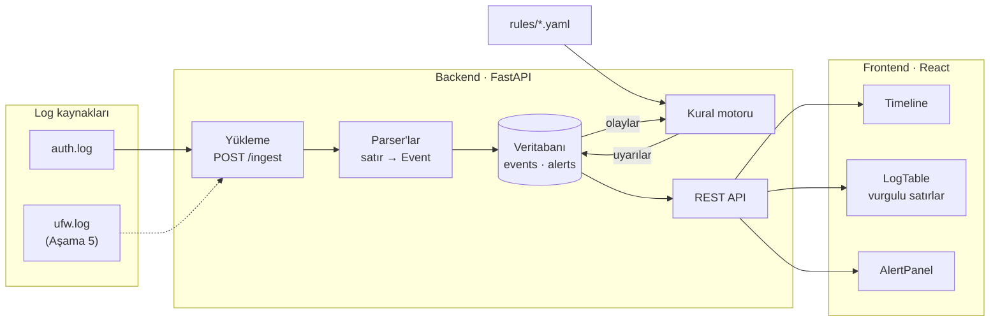

# log-analyzer

Sunucu loglarını (ilk hedef: SSH `auth.log`) yapılandırılmış olaylara çevirip zaman çizelgesinde gösteren ve kural tabanlı uyarılar üreten bir log analiz aracı. Arka uç Python/FastAPI, arayüz React.

> **Durum:** Hazırlık aşaması tamam — depo iskeleti ve örnek veri hazır. Parser, API ve arayüz henüz yazılmadı; plan için [Yol haritası](#yol-haritası) bölümüne bak.

## Amaç

Bir sunucunun loglarına bakıp "burada ne oldu, ne zaman, kim yaptı?" sorusunu hızlı yanıtlamak:

- **Ayrıştırma:** ham satırlar zaman, kaynak IP, kullanıcı ve eylem (`auth_fail`, `auth_ok`, `invalid_user`, …) alanlarına ayrılır. Tanınmayan satırlar atılmaz, `unparsed` olarak saklanır.
- **Zaman çizelgesi:** olay yoğunluğu zaman ekseninde gösterilir; sıçramalar bir bakışta görülür.
- **Kurallar:** YAML ile yazılan anahtar kelime, eşik ve sıralı olay kuralları şüpheli davranışı işaretler.
- **Kanıt:** her uyarı, onu tetikleyen log satırlarıyla birlikte gösterilir; satırlarda eşleşen kısımlar vurgulanır.

## Mimari (taslak)



1. Log dosyası `POST /ingest` ile yüklenir; uygun parser her satırı bir `Event` kaydına çevirir.
2. Olaylar SQLAlchemy üzerinden veritabanına (başlangıçta SQLite) yazılır. Aynı dosya tekrar yüklenirse kopya oluşmaz (`source_file` + `line_no` benzersizdir).
3. Kural motoru `rules/` altındaki YAML kurallarıyla olayları tarar; eşleşmeleri kanıt satırlarıyla birlikte `Alert` olarak kaydeder.
4. React arayüzü REST API (`/events`, `/timeline`, `/alerts`, `/stats`) üzerinden zaman çizelgesini, log tablosunu ve uyarıları gösterir.

## Depo yapısı

```text
log-analyzer/
├── .github/workflows/
│   └── ci.yml            # her push'ta lint ve testler
├── backend/
│   ├── app/              # FastAPI uygulaması (Aşama 1'den itibaren dolacak)
│   ├── tests/
│   └── pyproject.toml    # bağımlılıklar ve pytest ayarı
├── frontend/             # React arayüzü (Aşama 3'te kurulacak)
├── samples/
│   ├── generate.py       # örnek log üreteci
│   └── auth.log          # üretilmiş, anonim örnek log
└── ruff.toml             # lint ve biçim ayarı
```

## Kurulum

Python 3.11 veya üstü gerekir. Komutlar depo kökünde çalıştırılır.

```bash
python3.11 -m venv .venv
source .venv/bin/activate          # Windows: .venv\Scripts\activate
pip install -e "backend[dev]"
```

Windows'ta sanal ortamı `py -3.11 -m venv .venv` ile oluşturabilirsin.

Kontroller:

```bash
ruff check .             # lint
ruff format --check .    # biçim
pytest backend           # testler
```

Aynı kontroller her push ve pull request'te GitHub Actions ile de çalışır (`.github/workflows/ci.yml`).

## Örnek veri

`samples/auth.log`, `samples/generate.py` tarafından üretilen sentetik bir SSH logudur: 9–10 Eylül arası 48 saat, 1.057 satır. Gerçek bir makineden hiçbir şey içermez; tüm IP adresleri RFC 5737 dokümantasyon aralıklarından (`192.0.2.0/24`, `198.51.100.0/24`, `203.0.113.0/24`), kullanıcı adları sabit bir listeden gelir.

Zaman damgaları klasik syslog biçimindedir ve yıl içermez (`Sep  9 03:12:39`); log 2026 yılı için üretildi.

Olağan etkinliğin arasına (üç kullanıcının oturumları, `sudo` komutları, saatlik cron, 56 farklı adresten tek tük giriş denemesi) kuralları sınamak için dört senaryo yerleştirildi:

| Kaynak IP | Zaman | Ne oluyor | Kurallar açısından |
|---|---|---|---|
| `198.51.100.23` | 9 Eyl 01:47–01:49 | Var olmayan 30 farklı kullanıcı adıyla birer deneme | Eşik kuralı tetiklenmeli |
| `203.0.113.45` | 9 Eyl 03:12–03:14<br>10 Eyl 15:40–15:41 | `root` için 71 başarısız parola, ertesi gün 32 tane daha | Eşik kuralı tetiklenmeli; iki dalga cooldown ve uyarı birleştirmeyi sınar |
| `198.51.100.77` | 9 Eyl 10:00–21:48 | 20–30 dakikada bir, toplam 29 başarısız parola | Hız eşiğinin altında kalır: eşik kuralı tetiklenmemeli |
| `203.0.113.99` | 10 Eyl 02:31–02:37 | `bob` için bir dakikada 24 başarısız parola, ardından **başarılı giriş** ve reddedilen iki `sudo` denemesi | Eşik kuralı ve "başarısızlıklardan sonra başarı" sıralı kuralı tetiklenmeli |

Bilinen kullanıcıların (`alice`, `bob`, `deploy`) hepsi `192.0.2.0/24` içinden bağlanır. `bob`, 9 Eylül 10:34'te kendi adresinden parolasını bir kez yanlış yazıp ardından giriş yapar; bu, sıralı kuralın alarm vermemesi gereken durumdur.

Logu yeniden üretmek için:

```bash
python samples/generate.py                      # samples/auth.log dosyasını yeniden yazar
python samples/generate.py --seed 7 -o baska.log
python samples/generate.py --start 2026-12-31   # Aralık → Ocak geçişini içeren log
```

Aynı `--seed` ve `--start` her zaman aynı dosyayı üretir. Testler, depodaki `auth.log` dosyasının üretecin varsayılan çıktısıyla birebir aynı olduğunu, dokümantasyon aralıkları dışında IP içermediğini ve senaryoların temel özelliklerini (üç hızlı saldırı yoğun, geri kalan her şey seyrek, yabancı adresten tek başarılı giriş) doğrular.

Gerçek loglar yanlışlıkla depoya girmesin diye `.gitignore` tüm `*.log` dosyalarını dışarıda tutar; yalnızca `samples/auth.log` izlenir.

## Yol haritası

| Aşama | Kapsam | Durum |
|---|---|---|
| Hazırlık | Depo iskeleti, bağımlılıklar, örnek veri | ✅ |
| 1 | Parser, veritabanı, `/ingest` ve `/events` | Sırada |
| 2 | Anahtar kelime ve eşik kuralları, `/alerts` | |
| 3 | React arayüzü: zaman çizelgesi, log tablosu, uyarı paneli | |
| 4 | Davranış kuralları: sıralı olay, port taraması, nadir port | |
| 5 | İkinci kaynak (UFW) ve canlı takip | |
| 6 | Yayına hazırlama: Docker, CI, dokümantasyon | |

## Lisans

[MIT](LICENSE)
