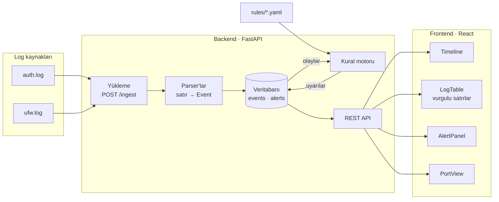

# log-analyzer

Sunucu loglarını (SSH `auth.log` ve güvenlik duvarı `ufw.log`) yapılandırılmış olaylara çevirip zaman çizelgesinde gösteren ve kural tabanlı uyarılar üreten bir log analiz aracı. Arka uç Python/FastAPI, arayüz React.

> **Durum:** Aşama 4 tamam — loglar ayrıştırılıp veritabanına yükleniyor; eşik, sıralı olay ve port taraması kuralları uyarı üretiyor; web arayüzü zaman çizelgesini, log satırlarını, uyarıları ve bir adresin denediği portları birlikte gösteriyor. Sıradaki adımlar için [Yol haritası](#yol-haritası) bölümüne bak.

## Amaç

Bir sunucunun loglarına bakıp "burada ne oldu, ne zaman, kim yaptı?" sorusunu hızlı yanıtlamak:

- **Ayrıştırma:** ham satırlar zaman, kaynak IP, port, kullanıcı ve eylem (`auth_fail`, `auth_ok`, `conn_block`, …) alanlarına ayrılır. Tanınmayan satırlar atılmaz, `unparsed` olarak saklanır.
- **Zaman çizelgesi:** olay yoğunluğu zaman ekseninde gösterilir; sıçramalar bir bakışta görülür.
- **Kurallar:** YAML ile yazılan anahtar kelime, eşik, sıralı olay ve port kuralları şüpheli davranışı işaretler.
- **Kanıt:** her uyarı, onu tetikleyen log satırlarıyla birlikte gösterilir; satırlarda eşleşen kısımlar vurgulanır.

## Mimari



1. Log dosyası `POST /ingest` ile yüklenir; uygun parser her satırı bir `Event` kaydına çevirir.
2. Olaylar SQLAlchemy üzerinden veritabanına (başlangıçta SQLite) yazılır. Aynı dosya tekrar yüklenirse kopya oluşmaz (`source_file` + `line_no` benzersizdir).
3. Kural motoru `rules/` altındaki YAML kurallarıyla olayları tarar; eşleşmeleri kanıt satırlarıyla birlikte `Alert` olarak kaydeder.
4. React arayüzü REST API (`/events`, `/timeline`, `/alerts`, `/stats`, `/ports`) üzerinden zaman çizelgesini, log tablosunu, uyarıları ve port görünümünü gösterir.

## Depo yapısı

```text
log-analyzer/
├── .github/workflows/
│   └── ci.yml            # her push'ta lint ve testler
├── backend/
│   ├── app/
│   │   ├── parsers/      # syslog başlığı, auth.log kalıpları, UFW paket logu, parser kayıt defteri
│   │   ├── rules/        # kural şeması, YAML yükleyici, değerlendiriciler, uyarı motoru
│   │   ├── routers/      # /health, /ingest, /events, /alerts, /rules, /timeline, /stats, /ports
│   │   ├── ingest.py     # satır satır okuma, toplu yazım
│   │   ├── models.py     # Event, Alert ve AlertEvent tabloları
│   │   └── main.py       # FastAPI uygulaması
│   ├── migrations/       # Alembic migration'ları
│   ├── tests/
│   ├── alembic.ini
│   └── pyproject.toml    # bağımlılıklar ve pytest ayarı
├── frontend/             # React arayüzü (Vite, TypeScript, Tailwind)
│   └── src/
│       ├── pages/        # Özet, İnceleme, Kurallar
│       ├── components/   # Timeline, LogTable, AlertPanel, PortView, FilterBar, ...
│       ├── lib/          # vurgu bölme, filtre ↔ adres, zaman ve port yardımcıları (testleriyle)
│       ├── demo/         # sunucusuz demo: örnek logların kaydı ve tarayıcıda çalışan API karşılığı
│       ├── api.ts        # API tipleri ve çağrıları
│       └── queries.ts    # TanStack Query kancaları
├── rules/                # tespit kuralları (YAML): KW-001, SSH-001, SSH-002, NET-001, NET-002
├── samples/
│   ├── generate.py       # örnek auth.log üreteci
│   ├── generate_ufw.py   # aynı iki günün güvenlik duvarı logunu üretir
│   ├── build_demo.py     # demo için API yanıtlarını kaydeder
│   ├── auth.log          # üretilmiş, anonim örnek loglar
│   └── ufw.log
└── ruff.toml             # lint ve biçim ayarı
```

## Kurulum

Python 3.11 veya üstü gerekir. Komutlar depo kökünde çalıştırılır.

```bash
python3.11 -m venv .venv
source .venv/bin/activate          # Windows: .venv\Scripts\activate
pip install -e "backend[dev]"
```

Windows'ta sanal ortamı `py -3.11 -m venv .venv` ile oluşturabilirsin.

Arayüz için Node.js 22 veya üstü gerekir:

```bash
cd frontend
npm install
```

Kontroller:

```bash
ruff check .             # lint
ruff format --check .    # biçim
pytest backend           # testler

cd frontend
npm run typecheck        # TypeScript tip denetimi
npm test                 # Vitest
npm run build            # üretim derlemesi
npm run build:demo       # sunucusuz demo derlemesi
```

Aynı kontroller her push ve pull request'te GitHub Actions ile de çalışır (`.github/workflows/ci.yml`).

## Çalıştırma

```bash
cd backend
alembic upgrade head             # veritabanını oluşturur: backend/log_analyzer.db
uvicorn app.main:app --reload    # http://127.0.0.1:8000
```

Başka bir terminalde, depo kökünden örnek logları yükleyip sorgula:

```bash
curl -F "file=@samples/auth.log" -F "year=2026" http://127.0.0.1:8000/ingest
# {"source_file":"auth.log","lines":1057,"parsed":605,"unparsed":452,"duplicates":0,"conflicts":0,"alerts":6}
curl -F "file=@samples/ufw.log" -F "year=2026" http://127.0.0.1:8000/ingest
# {"source_file":"ufw.log","lines":781,"parsed":781,"unparsed":0,"duplicates":0,"conflicts":0,"alerts":8}

curl "http://127.0.0.1:8000/alerts"
curl "http://127.0.0.1:8000/events?action=auth_ok&limit=5"
curl "http://127.0.0.1:8000/events?ip=203.0.113.99&start=2026-09-10T02:30:00Z"
curl "http://127.0.0.1:8000/ports?ip=198.51.100.150"
```

Arayüzü ayrı bir terminalde başlat:

```bash
cd frontend
npm run dev                      # http://localhost:5173
```

Arayüz API'yi `http://127.0.0.1:8000` adresinde arar; başka bir adres için `VITE_API_URL` ortam değişkenini ayarla. API tarafında arayüzün adresi `LOG_ANALYZER_CORS_ORIGINS` ile izinli olmalıdır (varsayılan: Vite geliştirme sunucusu).

Etkileşimli API dokümanı `http://127.0.0.1:8000/docs` adresindedir. Veritabanı adresi `LOG_ANALYZER_DATABASE_URL`, kural klasörü `LOG_ANALYZER_RULES_DIR` ortam değişkeniyle değiştirilebilir.

## Arayüz

Arayüzün fikri, üzeri işaretlenmiş bir log çıktısıdır: her şey log satırlarına geri döner, kanıt olan satırlar fosforlu kalemle çizilmiş gibi vurgulanır.

- **Özet:** Yüklenen logun sayıları, tüm dönemin zaman çizelgesi, uyarılar, en çok başarısız giriş denemesi yapan adresler ve log yükleme formu.
- **İnceleme:** Filtreler, zaman çizelgesi, log satırları ve uyarılar tek sayfada. Bir uyarıya tıklayınca çizelge o uyarının aralığına gider; tablo o aralıktaki tüm satırları gösterir, kanıt satırları kenar çizgisi ve vurgulu metinle ayrılır. Çizelgede sürükleyerek zaman aralığı seçilir. Filtreler sayfa adresinde tutulur, yani bir görünüm yer imine eklenebilir ve geri tuşu çalışır.
- **Port görünümü:** İnceleme sayfasında bir adres öne çıktığında (IP filtresi ya da o adresle ilgili bir uyarı) ve güvenlik duvarı o adresi kaydetmişse, zaman çizelgesinin altında aynı zaman ekseniyle bir port grafiği belirir: her paket bir işaret, düşey eksen hedef port. Tarama, kısa sürede dikey dağılan bir işaret yığını olarak görünür; tek porta ısrar, yatay bir sıra olarak. Altında en çok paket alan portlar ve güvenlik duvarının geçirdiği portlar listelenir.
- **Kurallar:** Yüklü kurallar (ne aradıkları cümleyle yazılır), yüklenemeyen kural dosyaları ve kuralları yeniden yükleme düğmesi.

### Demo: sunucusuz arayüz

Arayüzün, iki örnek logu içinde taşıyan ve hiçbir sunucuya bağlanmayan bir derlemesi vardır. Tek bir HTML dosyasıdır: diskten açılabilir, herhangi bir statik barındırıcıya konabilir.

```bash
cd frontend
npm run build:demo               # frontend/dist-demo/index.html (yaklaşık 1,5 MB)
```

Demoda zaman çizelgesi, filtreler, uyarılar, kanıt satırları, port görünümü ve kurallar sayfası gerçek arayüzdekiyle aynıdır; log yükleme, kuralları yeniden yükleme ve canlı takip yoktur. Veriler `frontend/src/demo/snapshot.json` dosyasından gelir: gerçek API'nin örnek loglar için verdiği yanıtların kaydı. Sorgular tarayıcıda yanıtlanır (`frontend/src/demo/backend.ts`), ve bu yanıtların API'ninkilerle aynı olduğu testlerle denetlenir: `cases.json` gerçek API'ye sorulmuş soruları ve yanıtlarını tutar, Vitest aynı soruları demoya sorar.

Parser ya da kurallar değişince kayıt yeniden üretilir; güncel değilse backend testleri bunu söyler:

```bash
python samples/build_demo.py     # snapshot.json ve cases.json dosyalarını yeniden yazar
```

Log tablosu yalnızca görünen satırları çizer (react-window) ve kaydırdıkça sonraki sayfaları getirir. Uzun satırlarda vurguların çevresindeki metin kısaltılır (`[UFW BLOCK] … SRC=198.51.100.150 … DPT=23`); satıra tıklayınca dosyadaki hali vurgularıyla birlikte görünür. Önem dereceleri renkle birlikte şekil ve yazıyla da gösterilir. Açık ve koyu tema vardır; zamanlar UTC olarak gösterilir.

## API

| Uç nokta | Ne yapar |
|---|---|
| `GET /health` | Veritabanı hazırsa `{"status": "ok"}` döner |
| `POST /ingest` | Log dosyası yükler (multipart form) ve kuralları yeniden çalıştırır. Alanlar: `file`, `parser` (`auto`, `auth`, `ufw`; varsayılan `auto`), `year`, `tz`, `source` |
| `GET /events` | Olayları zaman sırasıyla listeler. Filtreler: `start`, `end`, `host`, `service`, `ip`, `level`, `action`, `parsed`, `alert_id`, `rule_id`. Sayfalama: `limit` (1–500), `cursor` |
| `GET /alerts` | Uyarıları yeniden eskiye listeler. Filtreler: `rule_id`, `severity`, `group_key`, `start`, `end`. `include_events=true` her uyarının ilk 100 kanıt satırını ekler |
| `GET /timeline` | Seçilen olayları zaman kovalarına göre sayar (`bucket`: `1m`, `5m`, `1h`). `/events` ile aynı filtreleri alır |
| `GET /stats` | Özet sayıları döner: olay, ayrıştırılan, eylem dağılımı, önem derecesine göre uyarı, en çok başarısız giriş yapan adresler |
| `GET /ports` | Bir kaynak adresin (`ip`) denediği hedef portlar: port başına engellenen ve geçirilen paket sayısı, zaman sırasıyla tek tek paketler. `start` ve `end` ile aralık seçilir |
| `GET /rules` | Yüklü kuralları ve yüklenemeyen kural dosyalarını (nedeniyle) döner |
| `POST /rules/reload` | Kural dosyalarını yeniden okur ve kuralları saklanan tüm olaylar üzerinde baştan çalıştırır |

- **Zaman:** Syslog satırlarında yıl ve saat dilimi yoktur. `year` dosyanın ilk satırının yılıdır; verilmezse o satırı geleceğe düşürmeyen en yakın yıl kullanılır ve Aralık'tan Ocak'a geçişte yıl kendiliğinden ilerler. `tz` logu yazan makinenin saat dilimidir (ör. `Europe/Istanbul`, varsayılan `UTC`). Tüm zamanlar UTC olarak saklanır ve döner.
- **Parser:** `auto` bilinen bütün biçimlerin satırlarını tanır, yani aynı dosyada `sshd` ve çekirdek satırları bir arada olabilir (`/var/log/syslog` gibi). `auth` yalnızca `sshd` ve `sudo` satırlarını, `ufw` yalnızca çekirdeğin paket loglarını (`[UFW BLOCK]`, `[UFW ALLOW]`, `iptables` önekleri) tanır.
- **Her satır saklanır:** Tanınan satırlar alanlarıyla birlikte (`action`: `auth_fail`, `auth_ok`, `invalid_user`, `disconnect`, `sudo_exec`, `sudo_denied`, `conn_block`, `conn_allow`), tanınmayanlar `parsed=false` olarak. Yükleme yanıtında `lines = parsed + unparsed + duplicates + conflicts`.
- **Tekrar yükleme:** Satırlar dosya adı ve satır numarasıyla tanınır. Aynı dosya tekrar yüklenirse kopya oluşmaz (`duplicates`); büyümüş bir dosyada yalnızca yeni satırlar eklenir. Aynı satır numarasında farklı bir metin varsa (`conflicts`) saklanan satıra dokunulmaz: rotasyon sonrası aynı adı taşıyan başka bir dosyayı `source` alanıyla farklı bir adla yükle.
- **Sayfalama:** Yanıttaki `next_cursor` değeri sonraki isteğe `cursor` olarak verilir; son sayfada `null` olur.
- **Vurgular:** Bir uyarının kanıtı olan olaylar `highlights` alanında hangi uyarıya ve kurala ait olduklarını, `start`/`end` ile de `message` içinde işaretlenecek kısmı taşır. Bir uyarının bütün kanıtları `GET /events?alert_id=…` ile sayfalanır.
- **Zaman filtreleri:** `start` dahil, `end` hariçtir. Ofsetsiz zamanlar UTC sayılır. URL'de `+03:00` yazarken `+` işaretini `%2B` olarak kodla.

## Kurallar

Kurallar `rules/` klasöründeki YAML dosyalarıdır; her dosyada bir kural bulunur. Uygulama açılırken hepsini yükler. `POST /rules/reload` dosyaları yeniden okur ve kuralları saklanan tüm olaylar üzerinde baştan çalıştırır. Hatalı bir dosya diğerlerinin yüklenmesini engellemez; neyin yanlış olduğu `GET /rules` yanıtındaki `errors` listesinde yazar.

```yaml
# rules/SSH-001.yaml
id: SSH-001
name: SSH kaba kuvvet denemesi
type: threshold
severity: high
match:
  action: auth_fail
group_by: src_ip
threshold: 5
window_seconds: 60
cooldown_seconds: 300
summary: "{key} adresinden {seconds} sn içinde {count} başarısız giriş"
```

| Alan | Açıklama |
|---|---|
| `id`, `name`, `severity` | Kimlik, ad ve önem derecesi (`low`, `medium`, `high`, `critical`) |
| `type` | Kuralın türü; aşağıdaki tabloya bak |
| `match` | Kuralın baktığı olaylar: `action`, `service`, `host`, `user`, `level`, `dst_port`. Her biri tek değer ya da liste alır |
| `group_by` | Olayların gruplandığı alan: `src_ip`, `user`, `host` veya `service` |
| `cooldown_seconds` | Bir uyarının son olayından sonra bu süre içinde gelen eşleşmeler yeni uyarı açmaz, aynı uyarıya eklenir (varsayılan 300) |
| `allowlist` | Kuralın yok saydığı kaynak adresler ya da ağlar, ör. `192.0.2.0/24` |
| `summary` | Uyarı metni. `{key}`, `{count}`, `{seconds}`, `{rule_id}`, `{rule_name}` ve kural türünün kendi alanları (ör. `{threshold}`, `{ports}`) kullanılabilir |
| `enabled` | `false` ise kural yüklenir ama çalıştırılmaz |

Kural türleri ve kendi alanları:

| `type` | Ne zaman uyarır | Alanları |
|---|---|---|
| `keyword` | Mesajında aranan metin geçen her satırda | `keywords` (büyük/küçük harf ayrımı olmadan), `regex` |
| `threshold` | Bir gruptan kısa sürede çok sayıda eşleşen olay gelince | `threshold`, `window_seconds` |
| `sequence` | Bir grup, adımları sırayla ve süre dolmadan tamamlayınca | `steps` (her adımda `match` ve `count`), `within_seconds` |
| `port_scan` | Bir grup kısa sürede çok sayıda farklı hedef porta paket gönderince | `min_ports`, `window_seconds` |
| `rare_port` | Beklenmeyen bir porta bağlantı görülünce | `mode` (`watchlist`: listedeki portlar şüpheli; `allowlist`: listedekiler dışındaki her port şüpheli), `ports` |

```yaml
# rules/SSH-002.yaml
id: SSH-002
name: Başarısız denemelerden sonra başarılı giriş
type: sequence
severity: critical
group_by: src_ip
within_seconds: 600
steps:
  - match:
      action: auth_fail
    count: 5
  - match:
      action: auth_ok
summary: "{key} adresi başarısız denemelerin ardından giriş yaptı ({seconds} sn, {count} satır)"
```

```yaml
# rules/NET-001.yaml
id: NET-001
name: Port taraması
type: port_scan
severity: high
match:
  action: [conn_block, conn_allow]
group_by: src_ip
min_ports: 15
window_seconds: 60
summary: "{key} adresi {seconds} sn içinde {ports} farklı portu denedi"
```

Süreler hep aynı biçimde sayılır: ilk ve son olay arasındaki fark verilen saniyeden **küçük** olmalıdır; tam 60 saniyeye yayılan beş olay `window_seconds: 60` içinde sayılmaz. Bir sıralı kuralda süre son adımdan geriye doğru ölçülür, yani uzun süren bir deneme dizisi son bölümüyle yakalanır.

Uyarılar olaylardan ve kurallardan türetilir: her yüklemeden ve her `reload` çağrısından sonra yeniden hesaplanır. Aynı olay kümesinin uyarısı kimliğini korur; yeni olaylar geldikçe büyür.

Örnek `auth.log` yüklendiğinde altı uyarı oluşur. `SSH-001` üç saldırganı yakalar (`203.0.113.45` için iki dalga, iki ayrı uyarı), `SSH-002` parolayı bulup içeri giren saldırganı, `KW-001` onun `sudo cat /etc/shadow` denemesini. 29 kez deneyen yavaş saldırgan, tek tük denemeler ve parolasını bir kez yanlış yazan `bob` uyarı üretmez. `ufw.log` da yüklenince iki uyarı eklenir: `NET-001` port taramasını, `NET-002` açık kalmış uzak masaüstü portuna gelen bağlantıları yakalar; olağan trafik ve yavaş tarama uyarı üretmez.

## Örnek veri

İki örnek dosya aynı sunucunun aynı iki gününü anlatır ve birlikte yüklenebilir. İkisi de sentetiktir, gerçek bir makineden hiçbir şey içermez; tüm IP adresleri RFC 5737 dokümantasyon aralıklarından (`192.0.2.0/24`, `198.51.100.0/24`, `203.0.113.0/24`), kullanıcı adları sabit bir listeden gelir.

### auth.log

`samples/auth.log`, `samples/generate.py` tarafından üretilen bir SSH logudur: 9–10 Eylül arası 48 saat, 1.057 satır.

Zaman damgaları klasik syslog biçimindedir ve yıl içermez (`Sep  9 03:12:39`); log 2026 yılı için üretildi.

Olağan etkinliğin arasına (üç kullanıcının oturumları, `sudo` komutları, saatlik cron, 56 farklı adresten tek tük giriş denemesi) kuralları sınamak için dört senaryo yerleştirildi:

| Kaynak IP | Zaman | Ne oluyor | Kurallar açısından |
|---|---|---|---|
| `198.51.100.23` | 9 Eyl 01:47–01:49 | Var olmayan 30 farklı kullanıcı adıyla birer deneme | Eşik kuralı tetiklenmeli |
| `203.0.113.45` | 9 Eyl 03:12–03:14<br>10 Eyl 15:40–15:41 | `root` için 71 başarısız parola, ertesi gün 32 tane daha | Eşik kuralı tetiklenmeli; iki dalga cooldown ve uyarı birleştirmeyi sınar |
| `198.51.100.77` | 9 Eyl 10:00–21:48 | 20–30 dakikada bir, toplam 29 başarısız parola | Hız eşiğinin altında kalır: eşik kuralı tetiklenmemeli |
| `203.0.113.99` | 10 Eyl 02:31–02:37 | `bob` için bir dakikada 24 başarısız parola, ardından **başarılı giriş** ve reddedilen iki `sudo` denemesi | Eşik kuralı ve "başarısızlıklardan sonra başarı" sıralı kuralı tetiklenmeli |

Bilinen kullanıcıların (`alice`, `bob`, `deploy`) hepsi `192.0.2.0/24` içinden bağlanır. `bob`, 9 Eylül 10:34'te kendi adresinden parolasını bir kez yanlış yazıp ardından giriş yapar; bu, sıralı kuralın alarm vermemesi gereken durumdur.

Logu yeniden üretmek için:

```bash
python samples/generate.py                      # samples/auth.log dosyasını yeniden yazar
python samples/generate.py --seed 7 -o baska.log
python samples/generate.py --start 2026-12-31   # Aralık → Ocak geçişini içeren log
```

Aynı `--seed` ve `--start` her zaman aynı dosyayı üretir. Testler, depodaki `auth.log` dosyasının üretecin varsayılan çıktısıyla birebir aynı olduğunu, dokümantasyon aralıkları dışında IP içermediğini ve senaryoların temel özelliklerini (üç hızlı saldırı yoğun, geri kalan her şey seyrek, yabancı adresten tek başarılı giriş) doğrular.

### ufw.log

`samples/ufw.log`, `samples/generate_ufw.py` tarafından üretilen güvenlik duvarı logudur: 781 satır, hepsi çekirdeğin `[UFW BLOCK]` ve `[UFW ALLOW]` paket kayıtları. `auth.log` içindeki her SSH bağlantısı burada 22 numaralı porta geçirilen bir paket olarak görünür; ayrıca web trafiği (80, 443) ve internetin olağan gürültüsü (çeşitli portlara tek tük, engellenen paketler) vardır. Üç senaryo içerir:

| Kaynak IP | Zaman | Ne oluyor | Kurallar açısından |
|---|---|---|---|
| `198.51.100.150` | 9 Eyl 05:20 | 39 saniyede 120 farklı porta birer paket; açık üç port (22, 80, 443) dışında hepsi engellenir | `NET-001` tetiklenmeli |
| `203.0.113.150` | 9 Eyl 12:00–17:34 | Yarım saatte bir, toplam 12 farklı port | Pencereye sığmaz: `NET-001` tetiklenmemeli |
| `203.0.113.77` | 10 Eyl 13:05 | Unutulmuş bir kural yüzünden açık kalan 3389 (RDP) portuna geçirilen üç bağlantı | `NET-002` tetiklenmeli |

Tarama logu gerçek bir araçla değil üreteçle yazıldı; kendi laboratuvarında (yalnızca sahibi olduğun makinelerde) alınmış gerçek bir tarama logu aynı yoldan yüklenip denenebilir.

```bash
python samples/generate_ufw.py                  # samples/ufw.log dosyasını yeniden yazar
```

Gerçek loglar yanlışlıkla depoya girmesin diye `.gitignore` tüm `*.log` dosyalarını dışarıda tutar; yalnızca bu iki örnek dosya izlenir.

## Yol haritası

| Aşama | Kapsam | Durum |
|---|---|---|
| Hazırlık | Depo iskeleti, bağımlılıklar, örnek veri | ✅ |
| 1 | Parser, veritabanı, `/ingest` ve `/events` | ✅ |
| 2 | Anahtar kelime ve eşik kuralları, `/alerts` | ✅ |
| 3 | React arayüzü: zaman çizelgesi, log tablosu, uyarı paneli | ✅ |
| 4 | Davranış kuralları: sıralı olay, port taraması, nadir port; UFW parser'ı ve port görünümü | ✅ |
| 5 | Sıkıştırılmış ve rotasyonlu dosyalar, canlı takip | Sırada |
| 6 | Yayına hazırlama: Docker, CI, dokümantasyon | |

## Lisans

[MIT](LICENSE)
