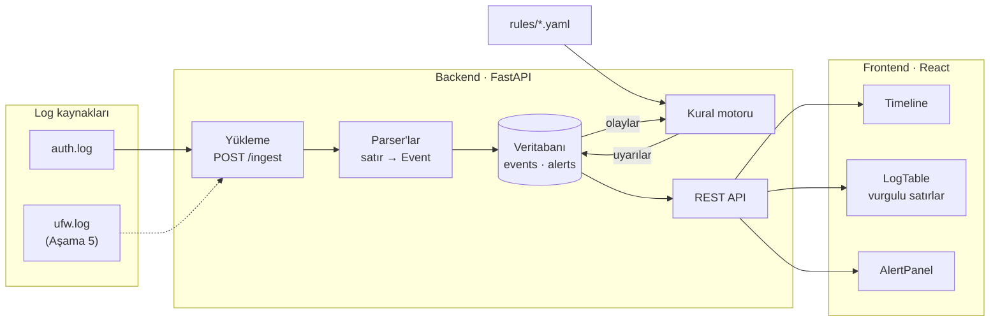

# log-analyzer

Sunucu loglarını (ilk hedef: SSH `auth.log`) yapılandırılmış olaylara çevirip zaman çizelgesinde gösteren ve kural tabanlı uyarılar üreten bir log analiz aracı. Arka uç Python/FastAPI, arayüz React.

> **Durum:** Aşama 2 tamam — loglar ayrıştırılıp veritabanına yükleniyor, kurallar uyarı üretiyor ve hepsi API üzerinden sorgulanabiliyor. Arayüz henüz yazılmadı; plan için [Yol haritası](#yol-haritası) bölümüne bak.

## Amaç

Bir sunucunun loglarına bakıp "burada ne oldu, ne zaman, kim yaptı?" sorusunu hızlı yanıtlamak:

- **Ayrıştırma:** ham satırlar zaman, kaynak IP, kullanıcı ve eylem (`auth_fail`, `auth_ok`, `invalid_user`, …) alanlarına ayrılır. Tanınmayan satırlar atılmaz, `unparsed` olarak saklanır.
- **Zaman çizelgesi:** olay yoğunluğu zaman ekseninde gösterilir; sıçramalar bir bakışta görülür.
- **Kurallar:** YAML ile yazılan anahtar kelime, eşik ve sıralı olay kuralları şüpheli davranışı işaretler.
- **Kanıt:** her uyarı, onu tetikleyen log satırlarıyla birlikte gösterilir; satırlarda eşleşen kısımlar vurgulanır.

## Mimari (taslak)



1. Log dosyası `POST /ingest` ile yüklenir; uygun parser her satırı bir `Event` kaydına çevirir.
2. Olaylar SQLAlchemy üzerinden veritabanına (başlangıçta SQLite) yazılır. Aynı dosya tekrar yüklenirse kopya oluşmaz (`source_file` + `line_no` benzersizdir).
3. Kural motoru `rules/` altındaki YAML kurallarıyla olayları tarar; eşleşmeleri kanıt satırlarıyla birlikte `Alert` olarak kaydeder.
4. React arayüzü REST API (`/events`, `/timeline`, `/alerts`, `/stats`) üzerinden zaman çizelgesini, log tablosunu ve uyarıları gösterir.

## Depo yapısı

```text
log-analyzer/
├── .github/workflows/
│   └── ci.yml            # her push'ta lint ve testler
├── backend/
│   ├── app/
│   │   ├── parsers/      # syslog başlığı, auth.log kalıpları, parser kayıt defteri
│   │   ├── rules/        # kural şeması, YAML yükleyici, değerlendiriciler, uyarı motoru
│   │   ├── routers/      # /health, /ingest, /events, /alerts, /rules
│   │   ├── ingest.py     # satır satır okuma, toplu yazım
│   │   ├── models.py     # Event, Alert ve AlertEvent tabloları
│   │   └── main.py       # FastAPI uygulaması
│   ├── migrations/       # Alembic migration'ları
│   ├── tests/
│   ├── alembic.ini
│   └── pyproject.toml    # bağımlılıklar ve pytest ayarı
├── frontend/             # React arayüzü (Aşama 3'te kurulacak)
├── rules/                # tespit kuralları (YAML): KW-001, SSH-001
├── samples/
│   ├── generate.py       # örnek log üreteci
│   └── auth.log          # üretilmiş, anonim örnek log
└── ruff.toml             # lint ve biçim ayarı
```

## Kurulum

Python 3.11 veya üstü gerekir. Komutlar depo kökünde çalıştırılır.

```bash
python3.11 -m venv .venv
source .venv/bin/activate          # Windows: .venv\Scripts\activate
pip install -e "backend[dev]"
```

Windows'ta sanal ortamı `py -3.11 -m venv .venv` ile oluşturabilirsin.

Kontroller:

```bash
ruff check .             # lint
ruff format --check .    # biçim
pytest backend           # testler
```

Aynı kontroller her push ve pull request'te GitHub Actions ile de çalışır (`.github/workflows/ci.yml`).

## Çalıştırma

```bash
cd backend
alembic upgrade head             # veritabanını oluşturur: backend/log_analyzer.db
uvicorn app.main:app --reload    # http://127.0.0.1:8000
```

Başka bir terminalde, depo kökünden örnek logu yükleyip sorgula:

```bash
curl -F "file=@samples/auth.log" -F "year=2026" http://127.0.0.1:8000/ingest
# {"source_file":"auth.log","lines":1057,"parsed":605,"unparsed":452,"duplicates":0,"conflicts":0,"alerts":5}

curl "http://127.0.0.1:8000/alerts"
curl "http://127.0.0.1:8000/events?action=auth_ok&limit=5"
curl "http://127.0.0.1:8000/events?ip=203.0.113.99&start=2026-09-10T02:30:00Z"
```

Etkileşimli API dokümanı `http://127.0.0.1:8000/docs` adresindedir. Veritabanı adresi `LOG_ANALYZER_DATABASE_URL`, kural klasörü `LOG_ANALYZER_RULES_DIR` ortam değişkeniyle değiştirilebilir.

## API

| Uç nokta | Ne yapar |
|---|---|
| `GET /health` | Veritabanı hazırsa `{"status": "ok"}` döner |
| `POST /ingest` | Log dosyası yükler (multipart form) ve kuralları yeniden çalıştırır. Alanlar: `file`, `parser` (varsayılan `auth`), `year`, `tz`, `source` |
| `GET /events` | Olayları zaman sırasıyla listeler. Filtreler: `start`, `end`, `host`, `service`, `ip`, `level`, `action`, `parsed`, `alert_id`, `rule_id`. Sayfalama: `limit` (1–500), `cursor` |
| `GET /alerts` | Uyarıları yeniden eskiye listeler. Filtreler: `rule_id`, `severity`, `group_key`, `start`, `end`. `include_events=true` her uyarının ilk 100 kanıt satırını ekler |
| `GET /rules` | Yüklü kuralları ve yüklenemeyen kural dosyalarını (nedeniyle) döner |
| `POST /rules/reload` | Kural dosyalarını yeniden okur ve kuralları saklanan tüm olaylar üzerinde baştan çalıştırır |

- **Zaman:** Syslog satırlarında yıl ve saat dilimi yoktur. `year` dosyanın ilk satırının yılıdır; verilmezse o satırı geleceğe düşürmeyen en yakın yıl kullanılır ve Aralık'tan Ocak'a geçişte yıl kendiliğinden ilerler. `tz` logu yazan makinenin saat dilimidir (ör. `Europe/Istanbul`, varsayılan `UTC`). Tüm zamanlar UTC olarak saklanır ve döner.
- **Her satır saklanır:** Tanınan satırlar alanlarıyla birlikte (`action`: `auth_fail`, `auth_ok`, `invalid_user`, `disconnect`, `sudo_exec`, `sudo_denied`), tanınmayanlar `parsed=false` olarak. Yükleme yanıtında `lines = parsed + unparsed + duplicates + conflicts`.
- **Tekrar yükleme:** Satırlar dosya adı ve satır numarasıyla tanınır. Aynı dosya tekrar yüklenirse kopya oluşmaz (`duplicates`); büyümüş bir dosyada yalnızca yeni satırlar eklenir. Aynı satır numarasında farklı bir metin varsa (`conflicts`) saklanan satıra dokunulmaz: rotasyon sonrası aynı adı taşıyan başka bir dosyayı `source` alanıyla farklı bir adla yükle.
- **Sayfalama:** Yanıttaki `next_cursor` değeri sonraki isteğe `cursor` olarak verilir; son sayfada `null` olur.
- **Vurgular:** Bir uyarının kanıtı olan olaylar `highlights` alanında hangi uyarıya ve kurala ait olduklarını, `start`/`end` ile de `message` içinde işaretlenecek kısmı taşır. Bir uyarının bütün kanıtları `GET /events?alert_id=…` ile sayfalanır.
- **Zaman filtreleri:** `start` dahil, `end` hariçtir. Ofsetsiz zamanlar UTC sayılır. URL'de `+03:00` yazarken `+` işaretini `%2B` olarak kodla.

## Kurallar

Kurallar `rules/` klasöründeki YAML dosyalarıdır; her dosyada bir kural bulunur. Uygulama açılırken hepsini yükler. `POST /rules/reload` dosyaları yeniden okur ve kuralları saklanan tüm olaylar üzerinde baştan çalıştırır. Hatalı bir dosya diğerlerinin yüklenmesini engellemez; neyin yanlış olduğu `GET /rules` yanıtındaki `errors` listesinde yazar.

```yaml
# rules/SSH-001.yaml
id: SSH-001
name: SSH kaba kuvvet denemesi
type: threshold
severity: high
match:
  action: auth_fail
group_by: src_ip
threshold: 5
window_seconds: 60
cooldown_seconds: 300
summary: "{key} adresinden {seconds} sn içinde {count} başarısız giriş"
```

| Alan | Açıklama |
|---|---|
| `id`, `name`, `severity` | Kimlik, ad ve önem derecesi (`low`, `medium`, `high`, `critical`) |
| `type` | `threshold`: bir gruptan `window_seconds` saniye içinde `threshold` olay gelirse uyarır. `keyword`: mesajında `keywords` listesindeki metinlerden biri (büyük/küçük harf ayrımı olmadan) ya da `regex` deseni geçen her satırda uyarır |
| `match` | Kuralın baktığı olaylar: `action`, `service`, `host`, `user`, `level`. Her biri tek değer ya da liste alır |
| `group_by` | Olayların gruplandığı alan: `src_ip`, `user`, `host` veya `service` |
| `cooldown_seconds` | Bir uyarının son olayından sonra bu süre içinde gelen eşleşmeler yeni uyarı açmaz, aynı uyarıya eklenir (varsayılan 300) |
| `allowlist` | Kuralın yok saydığı kaynak adresler ya da ağlar, ör. `192.0.2.0/24` |
| `summary` | Uyarı metni. `{key}`, `{count}`, `{seconds}`, `{rule_id}`, `{rule_name}`, eşik kurallarında ayrıca `{threshold}` ve `{window_seconds}` kullanılabilir |
| `enabled` | `false` ise kural yüklenir ama çalıştırılmaz |

Uyarılar olaylardan ve kurallardan türetilir: her yüklemeden ve her `reload` çağrısından sonra yeniden hesaplanır. Aynı olay kümesinin uyarısı kimliğini korur; yeni olaylar geldikçe büyür.

Örnek log yüklendiğinde beş uyarı oluşur. `SSH-001` üç saldırganı yakalar (`203.0.113.45` için iki dalga, iki ayrı uyarı), `KW-001` içeri giren saldırganın `sudo cat /etc/shadow` denemesini. 29 kez deneyen yavaş saldırgan ve tek tük denemeler eşiğin altında kalır.

## Örnek veri

`samples/auth.log`, `samples/generate.py` tarafından üretilen sentetik bir SSH logudur: 9–10 Eylül arası 48 saat, 1.057 satır. Gerçek bir makineden hiçbir şey içermez; tüm IP adresleri RFC 5737 dokümantasyon aralıklarından (`192.0.2.0/24`, `198.51.100.0/24`, `203.0.113.0/24`), kullanıcı adları sabit bir listeden gelir.

Zaman damgaları klasik syslog biçimindedir ve yıl içermez (`Sep  9 03:12:39`); log 2026 yılı için üretildi.

Olağan etkinliğin arasına (üç kullanıcının oturumları, `sudo` komutları, saatlik cron, 56 farklı adresten tek tük giriş denemesi) kuralları sınamak için dört senaryo yerleştirildi:

| Kaynak IP | Zaman | Ne oluyor | Kurallar açısından |
|---|---|---|---|
| `198.51.100.23` | 9 Eyl 01:47–01:49 | Var olmayan 30 farklı kullanıcı adıyla birer deneme | Eşik kuralı tetiklenmeli |
| `203.0.113.45` | 9 Eyl 03:12–03:14<br>10 Eyl 15:40–15:41 | `root` için 71 başarısız parola, ertesi gün 32 tane daha | Eşik kuralı tetiklenmeli; iki dalga cooldown ve uyarı birleştirmeyi sınar |
| `198.51.100.77` | 9 Eyl 10:00–21:48 | 20–30 dakikada bir, toplam 29 başarısız parola | Hız eşiğinin altında kalır: eşik kuralı tetiklenmemeli |
| `203.0.113.99` | 10 Eyl 02:31–02:37 | `bob` için bir dakikada 24 başarısız parola, ardından **başarılı giriş** ve reddedilen iki `sudo` denemesi | Eşik kuralı ve "başarısızlıklardan sonra başarı" sıralı kuralı tetiklenmeli |

Bilinen kullanıcıların (`alice`, `bob`, `deploy`) hepsi `192.0.2.0/24` içinden bağlanır. `bob`, 9 Eylül 10:34'te kendi adresinden parolasını bir kez yanlış yazıp ardından giriş yapar; bu, sıralı kuralın alarm vermemesi gereken durumdur.

Logu yeniden üretmek için:

```bash
python samples/generate.py                      # samples/auth.log dosyasını yeniden yazar
python samples/generate.py --seed 7 -o baska.log
python samples/generate.py --start 2026-12-31   # Aralık → Ocak geçişini içeren log
```

Aynı `--seed` ve `--start` her zaman aynı dosyayı üretir. Testler, depodaki `auth.log` dosyasının üretecin varsayılan çıktısıyla birebir aynı olduğunu, dokümantasyon aralıkları dışında IP içermediğini ve senaryoların temel özelliklerini (üç hızlı saldırı yoğun, geri kalan her şey seyrek, yabancı adresten tek başarılı giriş) doğrular.

Gerçek loglar yanlışlıkla depoya girmesin diye `.gitignore` tüm `*.log` dosyalarını dışarıda tutar; yalnızca `samples/auth.log` izlenir.

## Yol haritası

| Aşama | Kapsam | Durum |
|---|---|---|
| Hazırlık | Depo iskeleti, bağımlılıklar, örnek veri | ✅ |
| 1 | Parser, veritabanı, `/ingest` ve `/events` | ✅ |
| 2 | Anahtar kelime ve eşik kuralları, `/alerts` | ✅ |
| 3 | React arayüzü: zaman çizelgesi, log tablosu, uyarı paneli | Sırada |
| 4 | Davranış kuralları: sıralı olay, port taraması, nadir port | |
| 5 | İkinci kaynak (UFW) ve canlı takip | |
| 6 | Yayına hazırlama: Docker, CI, dokümantasyon | |

## Lisans

[MIT](LICENSE)
